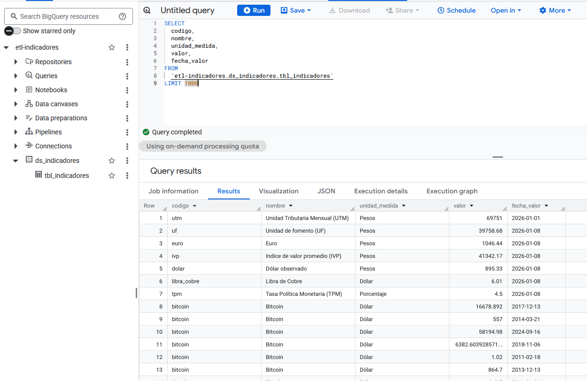
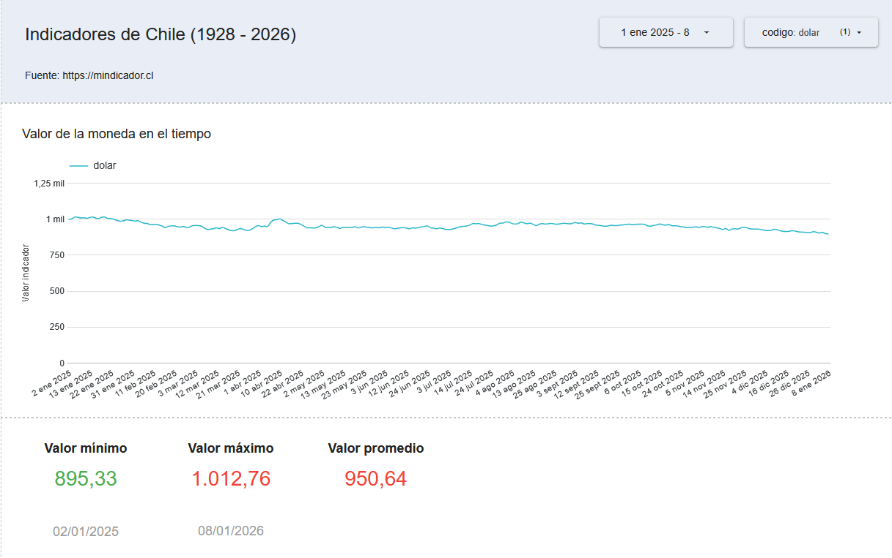

# Este documento es la continuación del **[README](README.md)** principal

# Configuración GCP

Específicamente Composer. Es necesario que sea que el tamaño del ambiente sea desde `large` en adelante (`extra large` o `custom`) ya que los ambientes más pequeños son extremadamente lentos y no logran terminar DAG en poco tiempo (si es que lo terminan).

```sh
EMAIL="my.email@gmail.com"

# Generar el ambiente de Composer
gcloud composer environments create etl-indicadores \
    --location $REGION \
    --image-version composer-3-airflow-2.10.5-build.23 \
    --service-account "${SA_EMAIL_AF}" \
    --environment-size large \
    --airflow-configs "^|^smtp-smtp_host=smtp.gmail.com|smtp-smtp_starttls=True|smtp-smtp_ssl=False|smtp-smtp_user=${EMAIL}|smtp-smtp_port=587|smtp-smtp_password_secret=smtp-password|smtp-smtp_mail_from=${EMAIL}"

# Importar las variables de ambiente al almacenamiento interno de Airflow
gcloud composer environments storage data import \
    --environment etl-indicadores \
    --location $REGION \
    --source=variables.json

# Cargar las variables en Airflow
gcloud composer environments run etl-indicadores \
    --location $REGION \
    variables import -- /home/airflow/gcs/data/variables.json

# Agregar pool para Airflow
gcloud composer environments run etl-indicadores \
    --location $REGION \
    pools set -- etl_api_mindicador_pool 2 "Pool para consumir API de mindicador.cl"
```

## SMTP

Las variables se deben asignar en la sección `Airflow configuration overrides`. En este caso Composer no permite setear la variable `smtp_password` debido a que quedan como texto plano en airflow.cfg lo que es inseguro. Para setear la password se usa otro método usando las variables `smtp_password_cmd` o `smtp_password_secret`.

Por conveniencia usé la segunda opción: `smtp_password_secret`

```sh
# Crear secreto con el password del smtp
echo -n "SMTP_PASSWORD" | gcloud secrets create \
  airflow-config-smtp-password \
  --data-file=- \
  --replication-policy=user-managed
  --locations=$REGION
```

- Referencia: https://docs.cloud.google.com/composer/docs/composer-3/configure-email#smtp_password

## Ejecución exitosa

### Airflow

Este es un pantallazo de una ejecución exitosa solo del DAG diario. El DAG histórico toma tiempo (se ejecuta anualmente con catchup=True que lo hace ejecutar desde 1928 hasta el 2026).


### BigQuery

Una simple query sobre la data cargada en BigQuery



### Looker Studio

Un gráfico para visualizar los valores cargados en BigQuery


