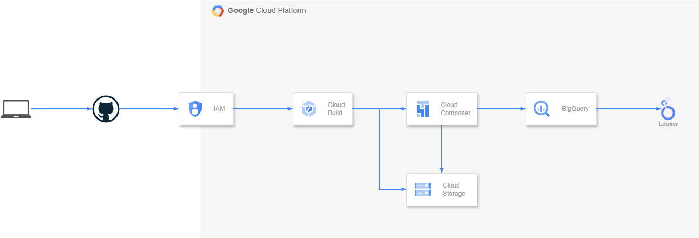

# Proyecto de ETL de indicadores de Chile en GCP

_Este proyecto utiliza la API https://mindicador.cl. Ajusté las configuraciones de los DAGs para no consumirlo en exceso (con pools) y evitar colapsarlo._

---

Estos comandos son de uso común para la ejecución en GCP como en local.
La estructura del proyecto es una variación del presentado en el siguiente enlace: https://docs.cloud.google.com/composer/docs/composer-3/dag-cicd-github.

Este proyecto utiliza Cloud Build para el despliegue y traspaso de DAGs al ambiente en Composer. Sigue la misma lógica del build `add-dags-to-composer` en el enlace anterior:

- Modificar DAGs
- Pushear a master
- Ejecutar los tests
- Mover los DAGs a Composer

Si no hay modificaciones en los DAGs el build no se ejecuta, aunque hayan cambios en otros archivos.

Existen 2 dags con lógica interna casi idéntica. Para simplificar el desarrollo y las pruebas en ambientes GCP se separó en 2 DAGs con la pequeña diferencia que el DAG `indicadores_backfill` se ejecuta de forma anual desde 1928 hasta 2026. En cambio el DAG `indicadores_daily` se ejecuta de forma diaria una vez al día a las 9am. Esto también afecta el como cada DAG consume la API.

# Configuración común

Configuración común tanto para GCP como para local. Local se conecta a BigQuery directamente por lo que es necesario realizar estos pasos.

```bash
export PROJECT_ID="etl-indicadores"
export REGION="us-central1"
export PROJECT_NUMBER=$(gcloud projects describe $PROJECT_ID --format="value(projectNumber)")
export BQ_DATASET="ds_indicadores"
export BQ_TABLE="tbl_indicadores"

gcloud config set project $PROJECT_ID
```

## Crear una cuenta de servicio para Composer y asignarle persmisos sobre Cloud Storage, BigQuery y Logging

```sh
gcloud iam service-accounts create airflow-app-sa \
  --description="Cuenta de servicio para Airflow"

SA_EMAIL_AF="airflow-app-sa@${PROJECT_ID}.iam.gserviceaccount.com"

gcloud projects add-iam-policy-binding $PROJECT_ID --member="serviceAccount:${SA_EMAIL_AF}" --role="roles/storage.objectUser"
gcloud projects add-iam-policy-binding $PROJECT_ID --member="serviceAccount:${SA_EMAIL_AF}" --role="roles/bigquery.user"
gcloud projects add-iam-policy-binding $PROJECT_ID --member="serviceAccount:${SA_EMAIL_AF}" --role="roles/logging.logWriter"
gcloud projects add-iam-policy-binding $PROJECT_ID --member="serviceAccount:${SA_EMAIL_AF}" --role="roles/composer.worker"
```

## Crear una cuenta de servicio para Cloud Build y asignarle permisos sobre Cloud Storage, Cloud Build y Logging

```sh
gcloud iam service-accounts create cloudbuild-app-sa \
  --description="Cuenta de servicio para Cloud Build"

SA_EMAIL_CB="cloudbuild-app-sa@${PROJECT_ID}.iam.gserviceaccount.com"

gcloud projects add-iam-policy-binding $PROJECT_ID --member="serviceAccount:${SA_EMAIL_CB}" --role="roles/storage.objectUser"
gcloud projects add-iam-policy-binding $PROJECT_ID --member="serviceAccount:${SA_EMAIL_CB}" --role="roles/cloudbuild.builds.editor"
gcloud projects add-iam-policy-binding $PROJECT_ID --member="serviceAccount:${SA_EMAIL_CB}" --role="roles/logging.viewer"
gcloud projects add-iam-policy-binding $PROJECT_ID --member="serviceAccount:${SA_EMAIL_CB}" --role="roles/logging.logWriter"
```

- Referencia: para ver configuración de Cloud Build que no se abarca en este documento: https://docs.cloud.google.com/composer/docs/composer-3/dag-cicd-github (_no se sigue al pie de la letra, solo se toma una parte de la documentación_)

## Eliminar tabla y dataset (opcional)

En caso de querer recrear el dataset y la tabla

```sh
bq rm --table=true $PROJECT_ID:$BQ_DATASET.$BQ_TABLE
bq rm --dataset=true $PROJECT_ID:$BQ_DATASET
```

## Crear dataset y tabla en BigQuery

```sh
bq mk --dataset --location=$REGION $PROJECT_ID:$BQ_DATASET

bq mk --table --clustering_fields=codigo,valor,fecha_valor \
--description="Tabla con indicadores historicos" \
--schema=./table_schema.json \
$PROJECT_ID:$BQ_DATASET.$BQ_TABLE
```

Se usaron campos `clustering` en vez de particiones debido a la siguiente regla

> _Partitioning results in a small amount of data per partition (approximately less than 10 GB). Creating many small partitions increases the table's metadata, and can affect metadata access times when querying the table._

Referencia: https://docs.cloud.google.com/bigquery/docs/partitioned-tables

## Dar permisos al usuario sobre el dataset

Esto es necesario ya que si elimino el dataset y la tabla con el comando `bq`
se pierden todos los permisos.

```sh
gcloud projects add-iam-policy-binding $PROJECT_ID --member="serviceAccount:${SA_EMAIL_AF}" --role="roles/bigquery.dataEditor"
```

# Configuración GCP

### Ver documento **[GCP](GCP.md)**

# Configuración local

### Ver documento **[LOCAL](LOCAL.md)**

<br>
<br>
<br>

# Diagrama


